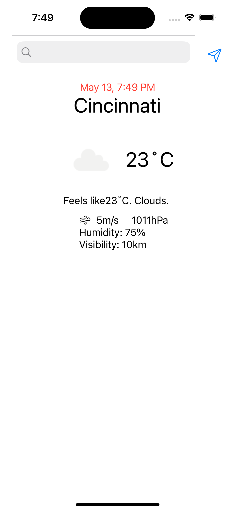
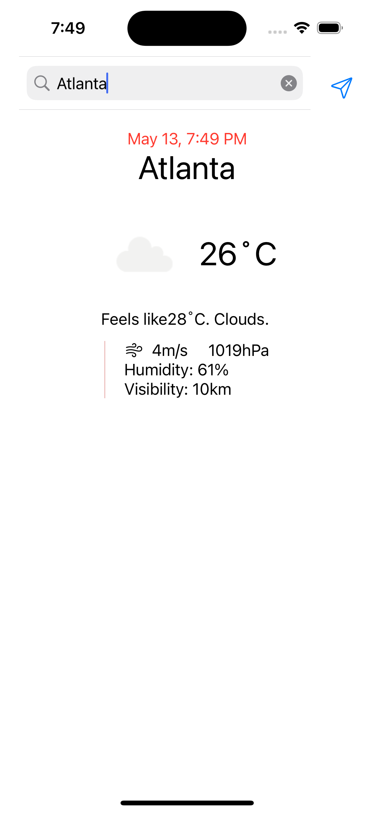

This is  open weather app for a inteview


## 🚀 Features
```
UIKit mixed with SwiftUI
MVVM pattern
TDD development
```
### 🖼 Overlays
```
Based on MVVM pattern
    * Views
        RootViewController
            Used UIKit, UISearchBar, UIButton
            // this view split two parts
            // (1)   up part based on UIKit and will show search bar
            // (2)   bottom part based on SwiftUI
            // (2.1) show time bar
            // (2.2) show weather information
           // (2.3) show location or map information
        MainInfoView
            Used SwiftUI             
    * ViewModel
        load data and combine with views
    * Model
        defined data structur
    * Service
        Network:
            URLs
                save the real URLs and return available URLs
            NetworkManager
                send data by async/wait and clouser method
        LocationService:
            Support Location Manager
        MockService
            supply mock data for test and developing
    * Global
        Global
            defined some global preperties, like appId
        Utils
            defined global functiun, like data convert, string operation. Logger. 

TDD: 
    WeatherIcon_JLTests
    WeatherIcon_JLUITests
```
### 🛠 Appearance / Behavior Customization


### 👀 Adapt visibility of:


### 🪄 Custom controls


## 💻 Supported Platforms

| 📱 | iOS 13+ |
| :-: | :-: |
| 🖥 | **macOS 10.15+** | 
| 📺 | **tvOS 13+** |
| ⌚️ | **watchOS 6+** |


### 📌 Annotations: The old-fashioned approach


## 🔩 Installation


## ✍️ Author

Jian Li

## 📄 License

